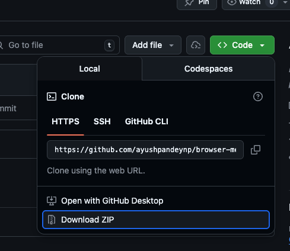
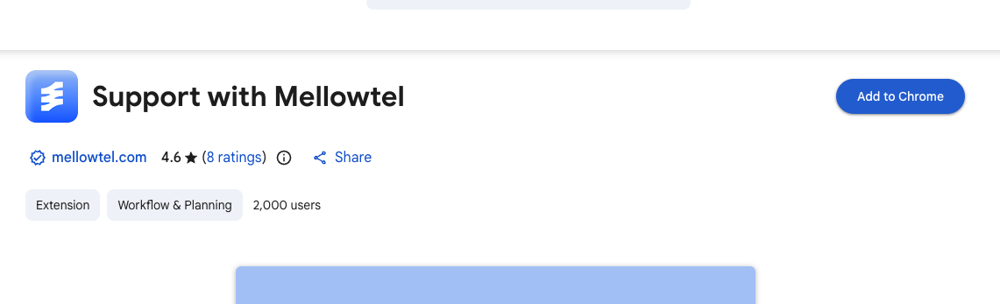
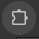
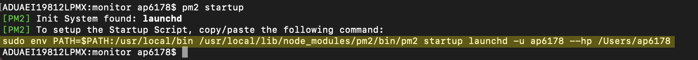
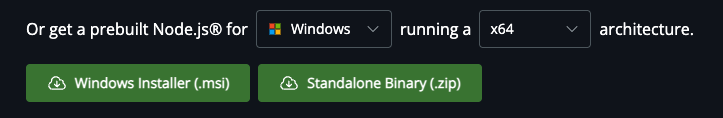

# Browser Measurement Experiment

Please follow the instructions below step by step to install the requirements. If you face any issue/error on any part of the step, please contact me before moving on to the next step.

### Step 1
Download this respository. You can use the green **Code** button on this page then **Download ZIP**. After download, unzip the file.



## Step 2
- If you do not have Google Chrome, please install this browser using [this link](https://www.google.com/chrome/). Do not use another browser.
- Download and install this extension [**Support with Mellowtel**](https://chromewebstore.google.com/detail/support-with-mellowtel/jngbedjpioeongcicaomeideeompcbcc) from the Chrome Web Store using Google Chrome browser. You need to click on "Add to Chrome".



- On Chrome, type ```chrome://extensions/``` in the address bar. This will take you to the extensions page. Turn on **Developer mode** on the top right corner of this page.
- Click on **Load unpacked** and select the folder ```browser-measurement/extension```.
- Now, select the extensions icon  to the right of your Google Chrome address bar and select "IFrame Monitor".
- You will be asked to enter your **User ID**. Please input your NYU Net ID and click on "Save".

## Step 3: macOS Users
If you have Windows, please ignore this section and move to "Step 3: Windows Users".
- On terminal, type ```brew install speedtest-cli``` to install the speedtest package for macOS.
- Now, navigate to the location you unzipped the file. For eg: if the unzipped folder is stored inside your Downloads folder, run ```cd /Users/YOUR_USERNAME/Downloads/browser-measurement/```
- Download Node.js and install it on your system. Please [use this link](https://nodejs.org/en/download) to download the "macOS Installer (.pkg)".


- Once you have installed Node.js, go to the terminal and run the following. Make sure you are inside ```browser-measurement``` folder. Replace ```YOUR_NET_ID``` with your NYU Net ID.
```bash
npm i -g pm2
cd monitor
pm2 start monitor.js -- YOUR_NET_ID 2
pm2 startup
```

- You will see a command similar to the one highlighted in the following. Please copy that command and run it in the terminal. **Make sure you copy your command and not the exact one shown in the screenshot, because it will be different on your system.** You may be asked to enter your password.



- Finally, run ```pm2 save``` on your terminal.

Now, keep your laptop charged, connected to the internet at all times.

**If you face any issue at any point, please contact me via email and we can figure out a solution. Thank you so much for your effort.**


## Step 3: Windows Users
If you have macOS, please ignore this section and move to "Step 3: macOS Users".
- Navigate to the location you unzipped the file. For eg: if the unzipped folder is stored inside your Downloads folder, run ```cd C:\Users\YOUR_USERNAME\Downloads\browser-measurement```
- Download Node.js and install it on your system. Please [use this link](https://nodejs.org/en/download) to download the "Windows Installer (.msi)".



- Once you have installed Node.js, open Task Manager (Press Ctrl + Shift + Esc). [TODO]

Now, keep your laptop charged, connected to the internet at all times.

**If you face any issue at any point, please contact me via email and we can figure out a solution. Thank you so much for your effort.**